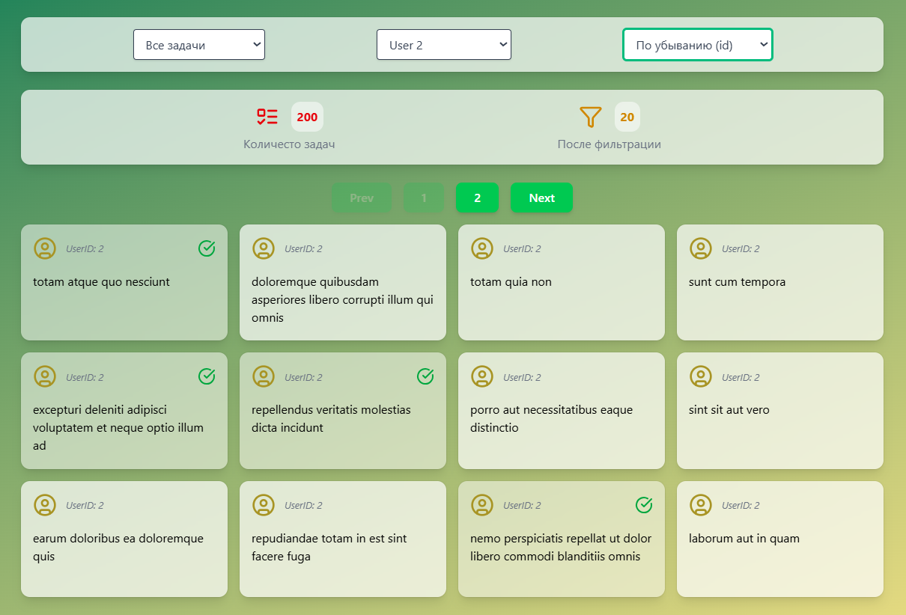

# TodoList App (React + Tailwind + Axios)

Приложение для отображения списка задач с [JSONPlaceholder](https://jsonplaceholder.typicode.com/todos).  
Реализованы фильтрация, сортировка, пагинация и статистика.

---

##  Функционал
- Загрузка данных из API с помощью **Axios**
- **Пагинация** с кнопками Prev/Next и номерами страниц
- **Фильтр по выполненности**: Все / Выполненные / Не выполненные
- **Фильтр по пользователю**: выбор из 10 пользователей
- **Сортировка** по ID (asc / desc)
- **Статистика**:
  - всего задач
  - количество после фильтров
- **Лоадер (спиннер)** при загрузке данных
- **Стилизация** с использованием **TailwindCSS**

---

## Структура проекта

src/
├─ hooks/
│ └─ useTodos.js # Хук для загрузки todos
├─ features/
│ └─ TodoList.jsx # Основной компонент списка задач
├─ shared/ui/
│ ├─ Button.jsx # Компонент кнопки
│ └─ Select.jsx # Компонент селекта
└─ features/TodoCard.jsx # Карточка задачи

yaml
Копировать код

---

## Установка и запуск

```bash
# клонировать репозиторий
git clone <your-repo-url>

# перейти в папку проекта
cd <project-name>

# установить зависимости
npm install

# запустить проект
npm run dev
```

## Технологии
-React 18
-Axios
-TailwindCSS
-Lucide-react (иконки)

## Скриншот интерфейса
